# Beamwars

A real-time multiplayer game written in JavaScript

## Scenarios

<table><tr><td></td><td>Time 0.1</td><td>Time 0.1</td><td>Time 0.2</td><td>Time 0.3</td><td>Time 0.4</td></tr><tr><td>Player0: </td><td></td><td>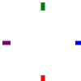</td><td>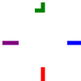</td><td></td><td></td></tr><tr><td>Server: </td><td></td><td></td><td>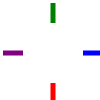</td><td>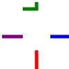</td><td>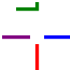</td></tr><tr><td>Player1: </td><td></td><td></td><td></td><td>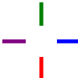</td><td></td></tr></table>

<table><tr><td></td><td>Time 0.1</td><td>Time 0.2</td><td>Time 0.3</td><td>Time 0.45</td><td>Time 0.6</td><td>Time 0.75</td><td>Time 0.8</td></tr><tr><td>Player0: </td><td></td><td>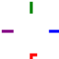</td><td>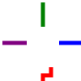</td><td>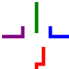</td><td>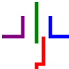</td><td>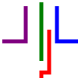</td><td>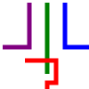</td></tr><tr><td>Player2: </td><td></td><td></td><td></td><td></td><td>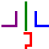</td><td>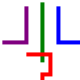</td><td></td></tr></table>
